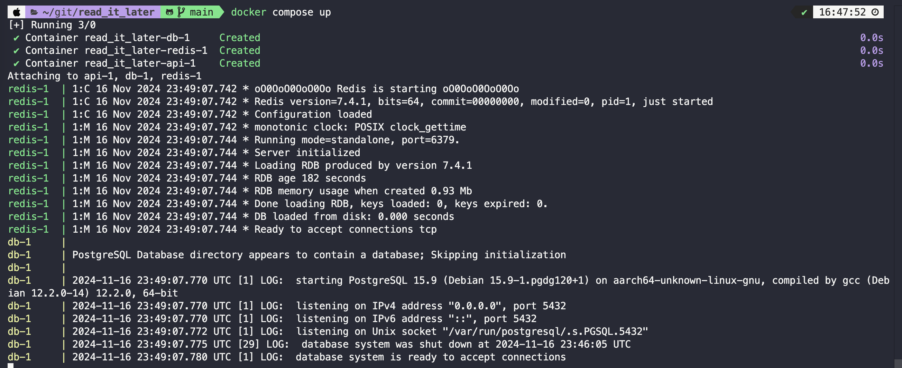
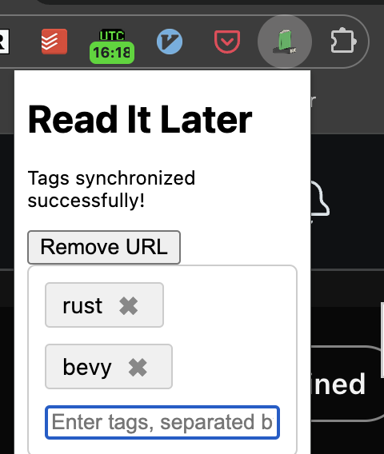
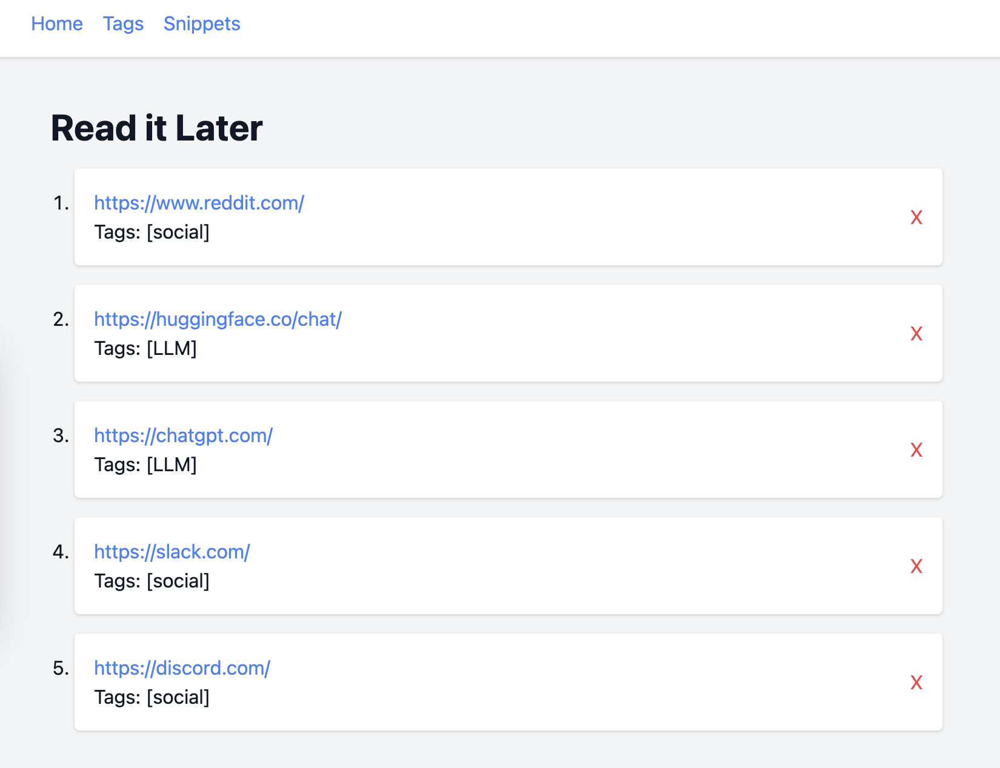

# Read it Later

An implementation of a read it later or bookmark manager style app (e.g. Pocket, Omnivore, Raindrop.io, etc.).

- API: Rust and Actix Web
- Database: Postgres
- Cache: Redis (not implemented yet)
- Client: Chrome Extension

## Configure

Create .env, updating with your desired users and passwords.

```ini
POSTGRES_USER=user
POSTGRES_PASSWORD=password
POSTGRES_DB=read_later
REDIS_PASSWORD=password
DATABASE_URL=postgres://user:password@db:5432/read_later
REDIS_URL=redis://:password@redis:6379
INDEX_RESPONSE="Welcome to the Read it Later app!"
WEB_PORT=8080
PACKAGE_NAME=read_it_later
POSTGRES_PORT=5432
REDIS_PORT=6379
```

## Run

```sh
docker compose up
# navigate to http://localhost:8080
```

## Rebuild

Rebuild if there are changes to the sourcecode.

```sh
docker compose up --build
```

## Chrome Extension

1. Go to chrome://extensions/
2. Enable developer mode
3. Click "Load Unpacked"
4. Open the directory "chrome-extension"
5. Pin the URL Poster app, navigate to a url, and submit a url

## API

### Add URL

```sh
curl -X POST http://localhost:8080/urls/url \
-H "Content-Type: application/json" \
-d '{"url": "https://example.com"}'
```

### Add URL with tags, or apply tags to existing URL

```sh
curl -X POST http://localhost:8080/urls/tags \
-H "Content-Type: application/json" \
-d '{"url": "https://example.com", "tags": "list,of,tags"}'
```

### Get URLs

```sh
curl -s http://localhost:8080/urls -H "Content-Type: application/json" | jq
```

Response
```json
[
  {
    "id": 21,
    "datetime": "2024-11-16T23:53:47.249492",
    "url": "https://github.com/hortonew/read_it_later",
    "url_hash": "48251ffc828eff7d7439ad486482d4463886bd59f94aead8f5e7fc185534abc9"
  },
  ...
]
```


### Get URLs with tags

```sh
curl -s http://localhost:8080/urls_with_tags -H "Content-Type: application/json" | jq
```

Response
```json
[
  {
    "url": "https://chatgpt.com/c/673a12a8-9db0-8010-8d60-fce4ec97f3c5",
    "tags": []
  },
  {
    "url": "https://www.reddit.com/r/rust/comments/1gtaai2/question_why_cant_two_static_strs_be_concatenated/",
    "tags": [
      "rust",
      "bevy"
    ]
  },
  ...
]
```

## Example

Start environment


Chrome Extension: Send URL



Saved URLs
